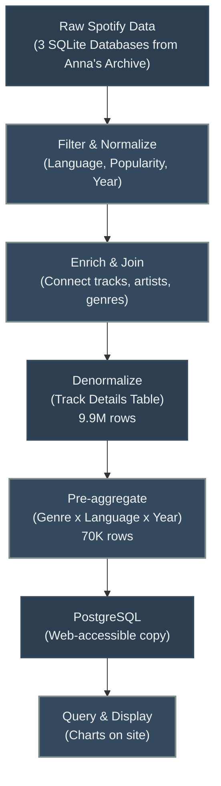
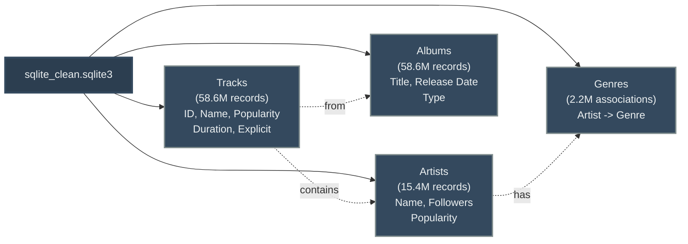
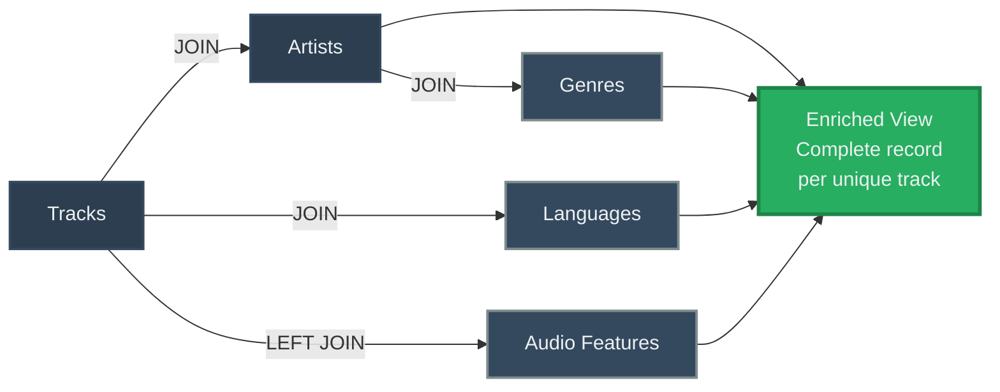
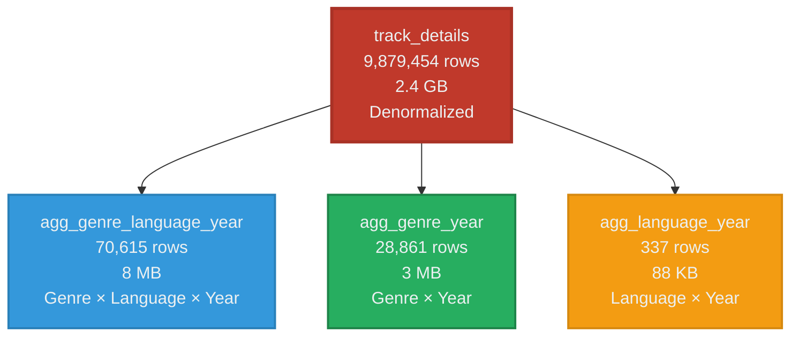

# Data Journey: How Our Statistics Are Built

This page explains the complete journey of Spotify music data-from raw metadata to the analytics you see on this site. We'll take you through every stage of the pipeline with real examples from our database.

---

## Raw Data Sources: Three Spotify Databases

This analysis uses three Spotify datasets archived by [Anna's Archive](https://web.archive.org/web/20251228191059/https://annas-archive.org/blog/backing-up-spotify.html), a community-driven open library that preserves music metadata and research datasets.


## The Big Picture: Our Data Pipeline



**Why Multiple Stages?**
- **Filtering** ensures focus on meaningful data (popular tracks, major languages)
- **Normalization** handles inconsistencies and duplicates
- **Denormalization** makes queries fast
- **Pre-aggregation** pre-computes expensive calculations
- **PostgreSQL** makes it all accessible via web queries

---

## Stage 1: Source Data - Three Raw Databases

We start with three Spotify datasets (from Anna's Archive):

### Database 1: `spotify_clean.sqlite3`
**The Foundation:** All track metadata



**Example Track:**
```
"Blinding Lights" by The Weeknd
  ID: 3n3Ppam7vgaVa1iaRUc9Lp
  Popularity: 95/100
  Duration: 3 min 20 sec (200,000 ms)
  Album: "After Hours" (2019)
```

---

### Database 2: `spotify_clean_track_files.sqlite3`
**The Language Layer:** Language + popularity annotations

Adds language metadata for ~18 million tracks:

```
Track ID                    Language    Popularity
3n3Ppam7vgaVa1iaRUc9Lp    → English  → 86/100
```

**Languages Available:** English, French, Spanish, German, Japanese, Polish

---

### Database 3: `spotify_clean_audio_features.sqlite3`
**The Sound Analysis:** 14 numerical features per track

```
Track ID    Tempo   Danceability  Energy  Valence  Acousticness
...         103     0.855         0.730   0.486    0.026
```

**What These Mean:**
- **Danceability** (0.0-1.0): How dance-friendly is the track?
- **Energy** (0.0-1.0): Intensity & activity level
- **Valence** (0.0-1.0): Musical positivity (major vs. minor keys)
- **Acousticness** (0.0-1.0): Acoustic instruments vs. electronic
- **Tempo (BPM):** Beats per minute
- And 9 more: loudness, speechiness, instrumentalness, liveness, key, mode, time signature, etc.

**Coverage Note:** We have audio features for ~350,000 tracks (3%). For the rest, these columns are empty.

---

## Stage 2: Filters - Narrowing Focus

We apply **three main filters** to keep data focused and clean:

```mermaid
graph LR
    START["Start<br/>58.6M tracks"] 
    
    FILTER1["Language Filter<br/>en, fr, es, de, ja, pl"]
    AFTER1["18M tracks<br/>(31% remain)"]
    
    FILTER2["Popularity Filter<br/>popularity > 5"]
    AFTER2["10M tracks<br/>(55% remain)"]
    
    FILTER3["Year Filter<br/>1970-2025"]
    AFTER3["9.9M tracks<br/>(FINAL)"]
    
    START --> FILTER1
    FILTER1 --> AFTER1
    AFTER1 --> FILTER2
    FILTER2 --> AFTER2
    AFTER2 --> FILTER3
    FILTER3 --> AFTER3
    
    style START fill:#c0392b,stroke:#a93226,stroke-width:2px,color:#ecf0f1
    style FILTER1 fill:#3498db,stroke:#2980b9,stroke-width:2px,color:#ecf0f1
    style FILTER2 fill:#27ae60,stroke:#1e8449,stroke-width:2px,color:#ecf0f1
    style FILTER3 fill:#f39c12,stroke:#d68910,stroke-width:2px,color:#ecf0f1
    style AFTER1 fill:#3498db,stroke:#2980b9,stroke-width:2px,color:#ecf0f1
    style AFTER2 fill:#27ae60,stroke:#1e8449,stroke-width:2px,color:#ecf0f1
    style AFTER3 fill:#8e44ad,stroke:#6c3483,stroke-width:3px,color:#ecf0f1
```



### Details of Each Filter:

### Filter 1: Language
**Rule:** Keep only tracks in: `en`, `fr`, `es`, `de`, `ja`, `pl`

**Why?** Focus on major global languages.

**Impact:** ~58.6M tracks → ~18M tracks (31% remain)

---

### Filter 2: Popularity
**Rule:** Keep only tracks where `popularity > 5` (scale 0-100)

**Why?** Remove obscure/test tracks, focus on real releases.

**Impact:** ~18M tracks → ~10M tracks (55% remain)

---

### Filter 3: Release Year
**Rule:** Keep years in the range [1970, 2025]

**Why?** Focus on recorded music era. Historical music from before 1970 is sparse anyway.

**Extracted From:** Album release dates (standardized format)

---

## Stage 3: Data Enrichment - Joining Across Databases

Now we connect everything:



**Result:** A unified view of each track with all its properties combined.

**Example Row After Enrichment:**

| Property | Value |
|----------|-------|
| Track ID | 3n3Ppam7vgaVa1iaRUc9Lp |
| Track Name | Blinding Lights |
| Artists | The Weeknd |
| Language | English |
| Release Year | 2019 |
| Popularity | 86 |
| Genres | pop, dark wave, synth-pop, electronic |
| Tempo | 103 BPM |
| Danceability | 0.855 |
| Energy | 0.730 |
| Valence | 0.486 |

---

## Stage 4: Processing Step 1 - Top 2000 Genres

**The Problem:** Spotify has 100,000+ genre labels. This creates sparsity.

**Our Solution:** Rank genres by frequency, keep only **top 2,000**.

**Genre Coverage:**
- **Top 50 genres:** Account for ~60% of all tracks
- **Top 500 genres:** Account for ~90% of all tracks
- **Top 2,000 genres:** Account for ~95% of all tracks
- **Remaining 98,000+ genres:** Niche, sparse data

**Example Top Genres:**
1. Pop (~500K tracks)
2. Rock (~300K tracks)
3. Indie (~200K tracks)
4. Alternative (~180K tracks)
5. Electronic (~150K tracks)
... and so on

**Result:** A clean, queryable genre list without the data sparsity of ultra-niche labels.

---

## Stage 5: Processing Step 2 - Denormalized Track Details

We create the **`track_details`** table: One row per track, containing everything.

**This is the source of truth** for:
- Feature visualizations (danceability by year/genre)
- Individual track searches
- Audio characteristic distributions

**Table Schema:**
```
- track_id (unique identifier)
- track_name, artists, album_name
- language_code, release_year
- track_popularity, genres
- danceability, energy, valence, acousticness, ...
- tempo, loudness, key, mode, ...
(20 columns total)
```

**Size:** 9,879,454 rows (~2.4 GB)

**Indexing:** Fast queries on language, year, genre

---

## Stage 6: Processing Step 3 - Pre-aggregated Tables

For **performance**, we pre-compute three aggregations:



### Table 3A: `agg_genre_language_year`

**Grouped By:** Genre + Language + Year

**What It Stores:**
```
Genre     | Language | Year | Track Count | Avg Popularity | Avg Danceability
Pop       | English  | 2020 | 892         | 68.5           | 0.71
Rock      | English  | 2015 | 456         | 52.1           | 0.58
Hip Hop   | English  | 2020 | 1,243       | 71.2           | 0.79
Electronic| French   | 2019 | 78          | 45.3           | 0.73
```

**Size:** 70,615 rows (~8 MB)

**Why Pre-aggregate?** A dashboard chart grouping 10 million tracks would take seconds to compute. Pre-aggregation makes it instant.

---

### Table 3B: `agg_genre_year`

**Grouped By:** Genre + Year (aggregated across all languages)

**Size:** 28,861 rows (~3 MB)

---

### Table 3C: `agg_language_year`

**Grouped By:** Language + Year (aggregated across all genres)

**Sample Data:**
```
Language  | Year | Track Count | Avg Popularity
English   | 2020 | 8,234       | 62.1
French    | 2020 | 1,456       | 58.3
Spanish   | 2020 | 987         | 59.2
German    | 2020 | 456         | 57.1
Japanese  | 2020 | 234         | 52.8
Polish    | 2020 | 89          | 51.3
```

**Size:** 337 rows (~88 KB) - Small enough to load in full!

---

## Stage 7: Load Into PostgreSQL

All processed tables are copied from SQLite to PostgreSQL (accessible at `kerboul.me:15433`).

**Why?** SQLite is great for processing, but PostgreSQL is better served over the web with concurrent queries.

---

## Stage 8: Query and Display

Data loaders (`*.json.js` files) query PostgreSQL and format results for visualizations:

```javascript
// Example: Get pop music trends
SELECT genre, release_year, SUM(track_count) as total_tracks
FROM agg_genre_language_year
WHERE genre = 'pop' AND language_code = 'en'
GROUP BY genre, release_year
ORDER BY release_year
```

Results power charts like:
- Stacked area charts (genre trends over time)
- Donut charts (current genre distribution)
- Line charts (feature evolution)
- Language breakdowns

---

## Case Study: One Track Through the Pipeline

Let's trace **"Blinding Lights" by The Weeknd** through each stage:

```mermaid
graph TD
    S1["Raw Database<br/>ID: 3n3Ppam7vgaVa1iaRUc9Lp<br/>Name: Blinding Lights<br/>Pop: 95, Duration: 200s<br/>Album: After Hours 2019<br/><br/>Pass?"]
    
    S2["Language Database<br/>Language: English<br/>Popularity: 86<br/><br/>Keep? Language in 6 langs"]
    
    S3["Popularity Filter<br/>Keep? 86 > 5"]
    
    S4["Year Extraction<br/>Album: After Hours 2019<br/>Release: 2019-11-29<br/>Year: 2019<br/>Keep? 1970-2025"]
    
    S5["Genre Assignment<br/>Artist → Genres<br/>The Weeknd → pop, dark wave<br/>synth-pop, electronic<br/>All in top 2000?"]
    
    S6["Audio Features<br/>Tempo: 103.33 BPM<br/>Danceability: 0.855<br/>Energy: 0.730<br/>Valence: 0.486"]
    
    S7["Final track_details Row<br/>track_id: 3n3Ppam7vgaVa1iaRUc9Lp<br/>track_name: Blinding Lights<br/>language_code: en<br/>release_year: 2019<br/>genres: pop | dark wave | synth-pop | electronic<br/>danceability: 0.855<br/>energy: 0.730<br/>valence: 0.486"]
    
    S8["agg_genre_language_year<br/>genre: pop<br/>language_code: en<br/>release_year: 2019<br/>track_count: +1 (among ~800)<br/>avg_popularity: includes 86<br/>avg_danceability: includes 0.855"]
    
    S1 --> S2
    S2 --> S3
    S3 --> S4
    S4 --> S5
    S5 --> S6
    S6 --> S7
    S7 --> S8
    
    style S1 fill:#c0392b,stroke:#a93226,stroke-width:2px,color:#ecf0f1
    style S2 fill:#27ae60,stroke:#1e8449,stroke-width:2px,color:#ecf0f1
    style S3 fill:#27ae60,stroke:#1e8449,stroke-width:2px,color:#ecf0f1
    style S4 fill:#f39c12,stroke:#d68910,stroke-width:2px,color:#ecf0f1
    style S5 fill:#3498db,stroke:#2980b9,stroke-width:2px,color:#ecf0f1
    style S6 fill:#e74c3c,stroke:#c0392b,stroke-width:2px,color:#ecf0f1
    style S7 fill:#9b59b6,stroke:#6c3483,stroke-width:3px,color:#ecf0f1
    style S8 fill:#2980b9,stroke:#1f618d,stroke-width:3px,color:#ecf0f1
```



### Details by Stage:

### **Raw Database:**
```
ID: 3n3Ppam7vgaVa1iaRUc9Lp
Name: "Blinding Lights"
Popularity: 95
Duration: 200,000 ms
Album: "After Hours" (Release: 2019-11-29)
Explicit: No
```

### **Language Database:**
```
Track: 3n3Ppam7vgaVa1iaRUc9Lp
Language: English
Popularity: 86
```

### **Audio Features:**
```
Tempo: 103.33 BPM
Danceability: 0.855 (↑ Very danceable!)
Energy: 0.730 (↑ High energy)
Valence: 0.486 (→ Neutral mood)
Acousticness: 0.0255 (↓ Mostly electronic)
```

### **After Genre Top 2000 Filter:**
Artist (The Weeknd) has genres: [pop, dark wave, synth-pop, electronic]
- All in top 2,000? Yes

### **Final `track_details` Row:**
```
track_id: 3n3Ppam7vgaVa1iaRUc9Lp
track_name: Blinding Lights
artists: The Weeknd
album_name: After Hours
language_code: en
release_year: 2019
track_popularity: 86
genres: pop | dark wave | synth-pop | electronic
danceability: 0.855
energy: 0.730
valence: 0.486
acousticness: 0.026
tempo: 103.33
... (other audio features)
```

### **In `agg_genre_language_year`:**
```
genre: pop
language_code: en
release_year: 2019
track_count: ... (includes this track)
avg_popularity: ... (includes 86 in the average)
avg_danceability: ... (includes 0.855)
```

### **Query Result on Site:**
When you view "2019 → Pop → English" on the site, this track is one of the ~800 that contribute to those statistics.

---

## Data Quality & Limitations

### **What's Reliable:**
- Track names, artists, release years
- Popularity scores
- Language identification
- Genre membership
- Audio features (Spotify's official measurements)

### **Limitations:**
- **Audio Features:** Only 3% coverage (350K of 9.9M tracks)
- **Language Ambiguity:** Bilingual tracks assigned to single language
- **Genre Sparsity:** Niche genres (> 2000) are dropped
- **Historical Gaps:** Pre-1980 data is thin (~1% of total)
- **Inconsistent Metadata:** Old records may have incomplete info

---
